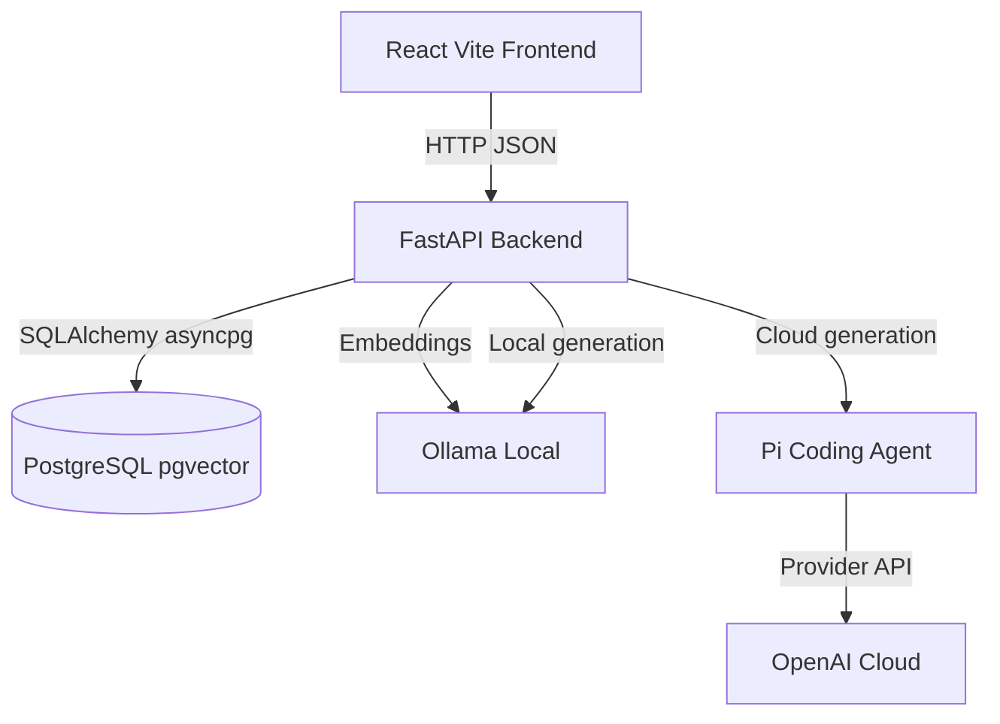
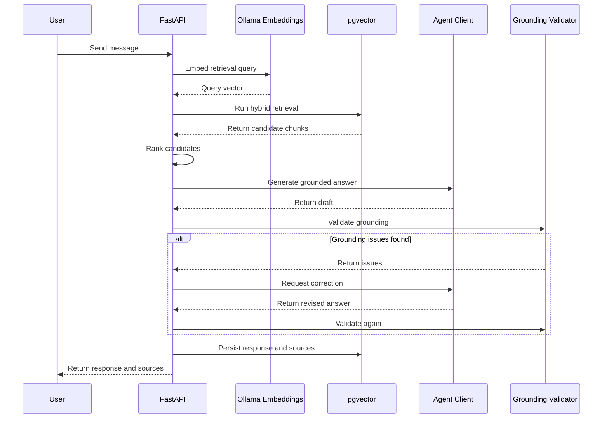

# Lenny Growth Assistant Architecture

This document details the system architecture of the Lenny Growth Assistant, covering the high-level request flow, component interactions, knowledge retrieval mechanisms, and explicit design trade-offs. 

---

## High-Level System Architecture

The Lenny Growth Assistant follows a three-tier architecture orchestrated via Docker Compose:

1. **Frontend**: A React single-page application built with Vite. It handles chat sessions, artifacts viewing (Markdown/HTML), and passes the user's preferred LLM provider mode to the backend per request.
2. **Backend**: A FastAPI application in Python 3.12 managing the API endpoints, session persistence, retrieval-augmented generation (RAG) pipelines, grounding validation, and LLM provider coordination.
3. **Data Layer**: PostgreSQL with the `pgvector` extension, responsible for persisting conversational state (sessions, messages, artifacts) and knowledge bases (document metadata, chunk texts, 768-dimensional vectors).

## Core Request Flow (Grounded RAG)

When a user submits a question, the system executes a grounded generation loop to enforce grounding constraints and reduce unsupported claims:

---

## Provider Routing & Agent Execution

The backend orchestrates LLM generation across three modes: `auto`, `local`, and `cloud`. A critical architectural invariant is that **retrieval embeddings always use Ollama locally (`nomic-embed-text`)**, regardless of the generation provider.

- **Local Mode**: All generation uses direct HTTP calls to the local Ollama instance (`/v1/chat/completions`). Chat uses `llama3.2:3b` and artifact/Ship30 generation uses `qwen3:4b-instruct`.
- **Cloud Mode**: All generation is sent to OpenAI (`gpt-5.4-mini`). Execution is delegated to the Pi Coding Agent (`@mariozechner/pi-coding-agent`), which is invoked as a subprocess (`--no-tools --no-session --mode json --print`). This prevents the backend from needing tight coupling to provider-specific SDKs. 
- **Auto Mode**: Asymmetric routing depending on the task:
  - **Chat**: Attempts local Ollama first. If the local generation times out or raises an error, and `CLOUD_FALLBACK_ENABLED=true`, it falls back to the cloud provider via Pi.
  - **Artifacts / Ship 30**: Routes directly to the cloud provider via Pi to maximize quality for long-form generation.

---

## Knowledge Retrieval Pipeline

### 1. Ingestion & Chunking
Markdown documents containing Lenny's Newsletter articles and Podcast transcripts are processed by a dedicated parser. Chunking logic depends on the source type:
- **Podcasts**: Chunked along speaker-turn boundaries with a ~1,200 character target. Retains specific YouTube/audio timestamp boundaries.
- **Newsletters**: Chunked along paragraph boundaries with a ~1,500 character target. 
- **Hashing**: A SHA-256 content hash tracks file states. Re-indexing a file skips unchanged documents, preventing redundant embedding costs.

### 2. Hybrid Retrieval with RRF
Retrieval is implemented in a single PostgreSQL query merging two strategies:
1. **Semantic Search**: `pgvector` cosine distance of the 768-dimensional query vector.
2. **Lexical Search**: PostgreSQL full-text search (`to_tsvector` and `to_tsquery`) scoring with `ts_rank_cd`.

The sets are unified using Reciprocal Rank Fusion (RRF) with a smoothing constant of `k=60`. 

### 3. Metadata Boost (Reranking)
The unified results are reranked in memory. An additive boost of `0.01` is applied to chunks where the exact guest name or significant title tokens from the source document appear in the user's query, ensuring highly specific episode/newsletter requests surface immediately.

---

## Grounded Generation & Validation

The system enforces grounding rules to reduce unsupported claims. The system prompt instructs the model to cite factual claims (`[1]`, `[2]`), quote verbatim, and refrain from hallucinated acronym expansions. 

Because LLMs do not perfectly obey prompt instructions, the `GroundingValidator` acts as a deterministic safety net.
1. **Quote Check**: Finds all substrings enclosed in quotes (straight or curly) longer than 12 characters. If the quote is not present verbatim in the normalized source text, it is flagged.
2. **Acronym Check**: Detects `ACRONYM (expansion)` patterns. If the pairing doesn't exist in the sources, it is flagged.

**Resolution flow**: 
The validator first attempts an auto-correction (e.g., stripping offending quotation marks or parenthetical expansions). If issues survive, the LLM is explicitly reprompted with the errors. If the second attempt fails, the system safely aborts and substitutes a fixed refusal message.

---

## Skills & Artifacts

### Ship 30 for 30 Skill
The Ship 30 writing skill is built as a separate internal execution path (`backend/app/assistant/skills/ship30.py`). 
- **Retrieval Scope**: Pulls 8 chunks (vs. 5 for chat). Expands the query with the last 3 user turns if the topic lacks standalone context.
- **Contract Execution**: The LLM receives strict structural requirements (e.g., ~1,250 words, specific H1, narrative progression, skimmability) in both the system and user prompts.
- **Validation**: Programmatically asserts the word count bounds (1,000–1,500 words), H1 presence, and citation density. Failures yield a `422 Unprocessable Entity` containing structured error details.

### HTML Artifacts & Security
HTML generation follows the same grounding pipeline (extracting text nodes for validation without altering attributes) but implements rigorous output isolation to prevent XSS.

- **Backend Validation**: Reject patterns block executable contexts before persistence (e.g., `<script\b`, `\bon\w+\s*=`, `javascript\s*:`, `<iframe\b`, `<object\b`, `<embed\b`). 
- **Frontend Isolation**: Renders in an `<iframe sandbox="">`. The empty sandbox string enforces strict constraints: it denies script execution, same-origin access, form submission, popups, and top-level navigation.
- **New-Tab Viewing**: Serves the artifact via a transient `Blob` URL. The `noopener,noreferrer` flags sever the opener relationship. (Note: The `sandbox=""` policies do not apply to the new tab, relying exclusively on the backend pattern validation for security).

---

## Persistence & State Management

PostgreSQL handles all conversational state and knowledge bases. 
- Independent chat sessions track message sequences natively. 
- Context window injection retrieves the last 6 message turns as history.
- Each generated message natively stores `source_chunk_ids` (a JSONB array). 
- When the `/messages` API returns a payload, these IDs are dynamically hydrated back into rich metadata (`source_url`, `guest`, `timestamps`), ensuring exact traceability for the frontend.
- Connections are explicitly released via `await db.rollback()` prior to long-running LLM generation to prevent connection pool exhaustion.

---

## Error Handling, Timeouts, & Observability

- **Structured Logging**: A JSON logger outputs events (`generation_started`, `retrieval_complete`, `grounding_retry_used`, `falling_back_to_cloud`) ensuring observability into the RAG lifecycle.
- **Resilience Codes**: Expected failure modes return semantic HTTP codes and a predictable JSON shape (`embedding_unavailable` -> 503, `cloud_provider_unavailable` -> 503, `artifact_generation_failed` -> 422). 
- **Timeouts**: Configured bounds enforce a 120-second timeout for standard chat and 300 seconds for artifacts. Subprocesses (Pi) are forcefully terminated via `asyncio.wait_for`.

---

## Architecture Decisions & Trade-offs

1. **PostgreSQL + pgvector over Dedicated Vector DBs**
   *Decision*: Standardizing on Postgres reduces operational complexity for local development. `pgvector` scales sufficiently for the Lenny corpus.
   *Trade-off*: Advanced features like native sparse vectors (BM25) require building custom SQL functions (`to_tsvector` full-text search) instead of using out-of-the-box hybrid search found in tools like Pinecone or Qdrant.

2. **Ollama (Embeddings) vs. Cloud Embeddings**
   *Decision*: Forcing local embeddings (`nomic-embed-text`) guarantees that user data ingestion does not incur per-token cloud costs, and developers can test ingestion entirely offline.
   *Trade-off*: When Cloud mode generation is selected, the system still demands a running Ollama container for the retrieval step.

3. **Pi Coding Agent for Cloud Provider Routing**
   *Decision*: Integrating OpenAI via the Pi Coding Agent CLI eliminates the need to manually implement streaming and provider SDK shims.
   *Trade-off*: Adds subprocess management overhead for cloud requests instead of native Python HTTP requests.

4. **Application-Owned Grounding Validator**
   *Decision*: Offloading strict grounding verification to a deterministic regex engine prevents LLM obedience drift.
   *Trade-off*: Occasionally forces expensive retries or rigid refusals if the LLM hallucinates minor formatting, adding latency.

5. **Sandbox Isolation & Validation**
   *Decision*: The backend forbids `<script>` tags rather than relying purely on frontend DOM purifiers. The frontend iframe uses an empty `sandbox=""` string.
   *Trade-off*: The security model intentionally limits executable and privileged HTML capabilities. In-app rendering receives stronger browser-enforced isolation through `iframe sandbox=""`, while new-tab rendering relies primarily on backend validation plus `noopener,noreferrer`. This keeps generated artifacts useful for static HTML/CSS while intentionally excluding scripts and other executable contexts.
